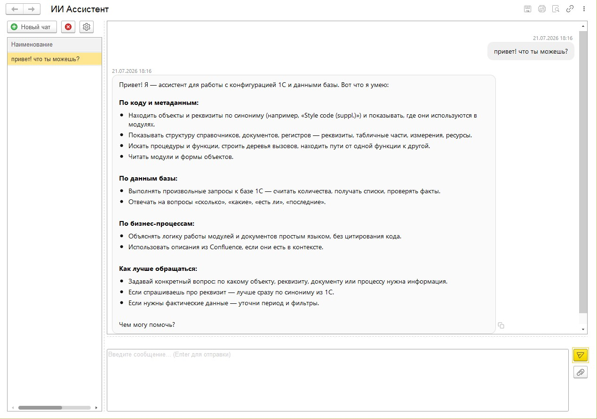
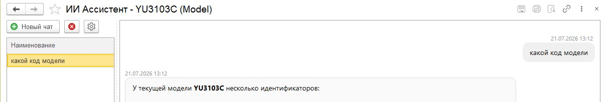

# ИИ-ассистент для 1С:Предприятия

[](LICENSE)

Бесплатное open-source расширение конфигурации 1С (CFE) с собственным чат-интерфейсом и on-premise шлюзом на Go. Позволяет подключить 1С к языковым моделям (LLM) и инструментам MCP, чтобы пользователи могли общаться с искусственным интеллектом прямо из интерфейса привычной учётной системы.

Проект подходит для типовых и отраслевых конфигураций 1С:Управление торговлей, 1С:ERP, 1С:Бухгалтерия предприятия, 1С:Розница и других решений на платформе 1С:Предприятие 8.3.

## Возможности

- **Чат с ИИ внутри 1С** — общайтесь с языковой моделью, не покидая интерфейс конфигурации.
- **Контекст открытого объекта** — задавайте вопросы по текущему справочнику, документу, отчёту или форме.
- **Работа с изображениями** — прикрепляйте скриншоты и документы, если выбранная LLM поддерживает режим Vision.
- **On-premise шлюз** — Go-приложение разворачивается на собственном сервере, данные не утекают в публичные сервисы.
- **Поддержка MCP** — интеграция с инструментами через протокол Model Context Protocol.
- **Фоновое выполнение запросов** — тяжёлые запросы к LLM выполняются в серверном фоновом задании 1С, клиент лишь проверяет статус.
- **История чата** — все ответы сохраняются и доступны для повторного просмотра.

## Для кого

- Разработчики 1С, которые хотят встроить ИИ в свою конфигурацию.
- Внедренцы и консультанты 1С, ищущие готовое расширение для работы с LLM.
- Компании, использующие 1С и планирующие добавить корпоративного ассистента на базе собственной или публичной языковой модели.

## Поддерживаемые языковые модели

Решение работает с любыми моделями, совместимыми с OpenAI API, в том числе:

- OpenAI (GPT-4o, GPT-4, GPT-3.5 и др.)
- Ollama — локальные модели в собственной инфраструктуре
- Другие провайдеры с OpenAI-совместимым API

## Скриншоты

### Главное окно чата


### Контекст открытого объекта


## Состав проекта

```
1c-ai-assistant-project/
├── cfe/        # Расширение конфигурации 1С (CFE)
├── gateway/    # Go-шлюз (HTTP API + MCP + LLM)
└── docs/       # Документация по архитектуре и развёртыванию
```

## Быстрые ссылки

- Репозиторий: https://github.com/voskorbin/1c-ai-assistant
- Документация:
  - [Архитектура](docs/architecture.md)
  - [Развёртывание](docs/deployment.md)
  - [Адаптация под конкретную базу](docs/adaptation.md)

## Установка и развёртывание

Подробная инструкция по установке расширения 1С и запуску Go-шлюза описана в разделе [Развёртывание](docs/deployment.md).

Кратко:

1. Импортируйте расширение `cfe/` в свою конфигурацию 1С.
2. Разверните и запустите шлюз `gateway/`.
3. Укажите в настройках 1С адрес шлюза и параметры подключения к LLM.
4. Откройте форму чата и начните диалог с ИИ-ассистентом.

## Лицензия

Распространяется под лицензией MIT. Подробности см. в файле [LICENSE](LICENSE).

## Участие в проекте

Приветствуются issue, pull request'ы и предложения по развитию. См. [CONTRIBUTING.md](CONTRIBUTING.md).
